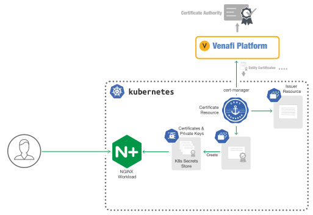
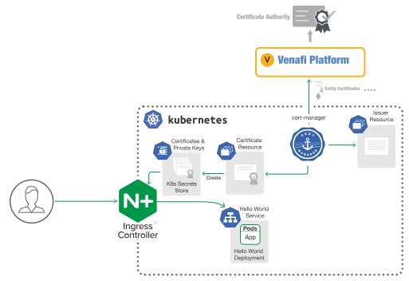
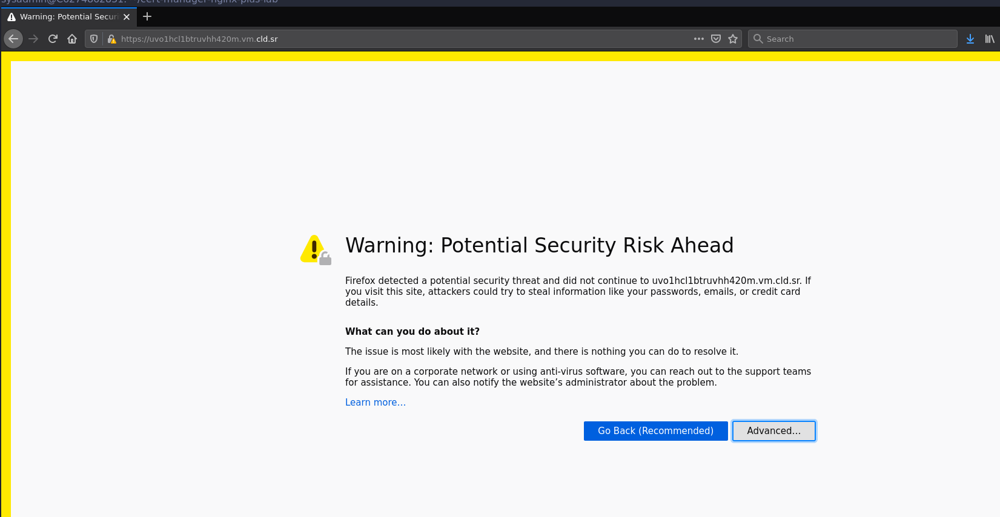
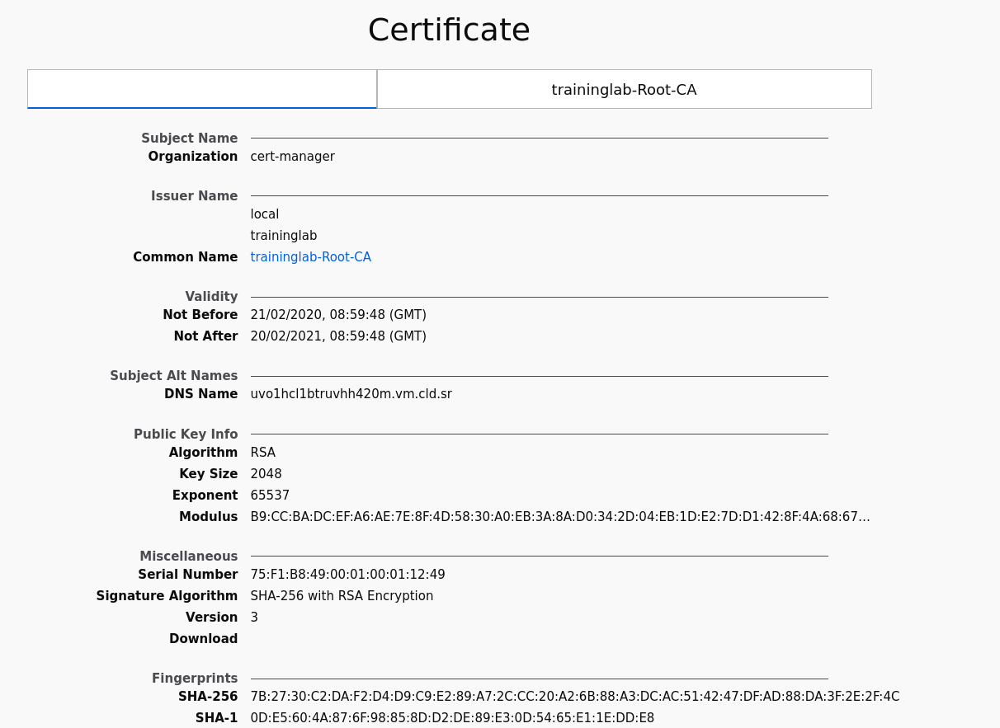
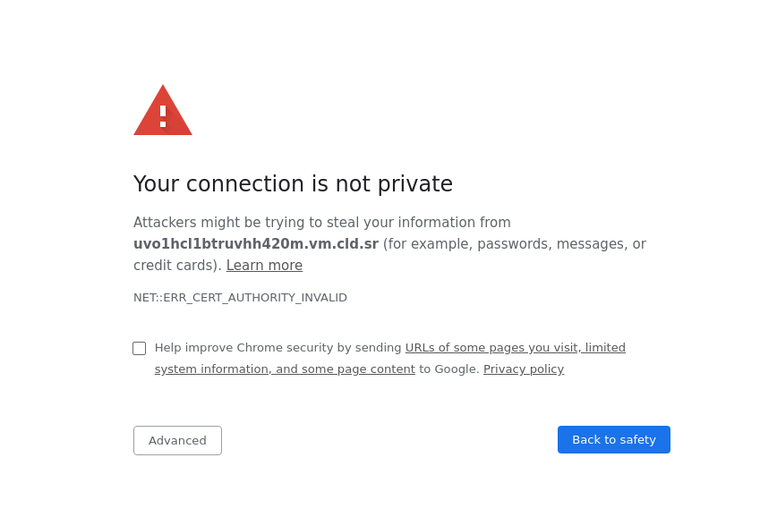
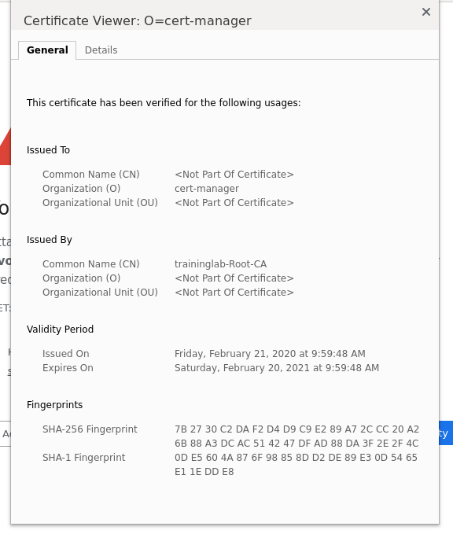

# Automating X.509 machine identities in Kubernetes 

## Securing NGINX (Plus) ingresses & workloads using Venafi and cert-manager

### Overview 

In this lab we will first identify the role and importance of machine identities (X.509 certificates) within organisations that are building new or 'next generation' infrastructures using containers, micro-services and other modern deployment technologies. Since Kubernetes has become the most pervasive 'Control Plane' for deploying and orchestrating containers, we will discuss the problems concerning identity and secure communications that must be solved for both developers and Information Security teams within this environment. 

The lab will provide attendees with a real Kubernetes single node cluster environment and will include the following components: 

- `Kubernetes`: a portable, extensible, open-source platform or control plane for managing containerised workloads and services.
- `NGINX Plus`: an enterprise licensed NGINX instance configured as an Ingress Controller for Kubernetes providing enterprise‑grade delivery services for Kubernetes applications.
- `NGINX`: an open-source licensed NGINX instance configured as a Kubernetes workload.
- `Venafi`: an enterprise platform for controlling the end to end lifecycle for all X.509 machine identities across all infrastructures
- `cert-manager`: a native [Kubernetes](https://kubernetes.io/) certificate management controller. It can help with issuing certificates from a variety of sources, such as [HashiCorp Vault](https://www.vaultproject.io/) and [Venafi](https://www.venafi.com/), or a simple signing key pair, or self signed certificate.

The lab will step through performing the following task: 

1. Installing `cert-manager`
2. Testing `cert-manager`
   1. Creating a Venafi credential stored in the Kubernetes secrets store
   2. Defining and configuring a `venafi issuer` resource
   3. Defining and configuring a `certificate` resource to use the `venafi issuer` 
   4. Requesting certificates using the `certificate` resource
3. Building and loading an `NGINX Plus` image into the Kubernetes cluster
4. Deploying and Securing an `NGINX Plus` Ingress controller using the `venafi issuer` resource
   1. Testing the `NGINX Plus` Ingress controller 
5. Deploying and Securing an `NGINX` workload using the `venafi issuer` resource
   1. Testing the `NGINX` workload

## Kubernetes

Kubernetes is a portable, extensible, open-source platform for managing containerised workloads and services, that facilitates both declarative configuration and automation. It has a large, rapidly growing ecosystem. Kubernetes services, support, and tools are widely available.  It is already in production with many of the worlds largest organisations and in some cases has been used to build entire next generation banking platforms.  

When you deploy Kubernetes, you get a cluster. A Kubernetes cluster consists of a set of worker machines, called nodes, that run containerised applications. Every cluster has at least one worker node.

The worker node(s) host the pods that are the components of the application. The Control Plane manages the worker nodes and the pods in the cluster. In production environments, the Control Plane usually runs across multiple computers and a cluster usually runs multiple nodes, providing fault-tolerance and high availability.

## NGINX

### NGINX Ingress Controller for Kubernetes 

The NGINX Ingress Controller for Kubernetes provides enterprise‑grade delivery services for Kubernetes applications, with benefits for users of both open source NGINX and NGINX Plus. With the NGINX Ingress Controller for Kubernetes, you get basic load balancing, SSL/TLS termination, support for URI rewrites, and upstream SSL/TLS encryption. NGINX Plus users additionally get session persistence for stateful applications and JSON Web Token (JWT) authentication for APIs.


*Enterprise-grade application delivery for Kubernetes*

By default, pods of Kubernetes services are not accessible from the external network, but only by other pods within the Kubernetes cluster. Kubernetes has a built‑in configuration for HTTP load balancing, called Ingress, that defines rules for external connectivity to Kubernetes services. Users who need to provide external access to their Kubernetes services create an *Ingress resource* that defines rules, including the URI path, backing service name, and other information. The Ingress controller can then automatically program a frontend load balancer to enable Ingress configuration. The NGINX Ingress Controller for Kubernetes is what enables Kubernetes to configure NGINX and NGINX Plus for load balancing Kubernetes services.

## Venafi 

The Venafi platform has been adopted by many of the worlds largest organisations for controlling the end to end lifecycle for all X.509 machine identities across their entire infrastructure. This includes infrastructures built upon traditional technologies such as load balancers, web servers, applications servers etc. and next generation on-premise, cloud, cloud native and hybrid environments built using next generation technology stacks including Kubernetes, containers, micro-services, service meshes etc.

## The Importance of Machine Identities

Enterprises are shifting to new highly automated, often ephemeral, container and micro-service based infrastructures and applications; these are often deployed and executed within zero trust networks. The ability to assert identity, establish trust and subsequently enable secure communications between all of the actors and (containers) entities within 'new compute' environments has never been more important. 

Whilst the traditional PKI model is far from perfect, it is still the only viable and widely accepted way to cryptographicly establish trust between machines. It is also the only standard way to enable encrypted communications between machines. Its hierarchical trust model means it's still currently the only way enterprises can truly scale and manage trust across their organisations. 

For large enterprises, the ability to effectively manage, control and automate the life-cycle for X.509 certificates across their traditional infrastructures has always been challenging. When this is done badly it has led to unknowns that turn into costly certificate-related outages, such as those seen at LinkedIn, O2, Softbank, Microsoft Azure and many others. Even worse, massive data breaches like that of Equifax in 2017 are often made worse by untracked, expiring certificates blind to attack.

For enterprises shifting to new container and micro-service based infrastructures, this problem is now significantly compounded due to highly automated build and deployment processes. Inherent capabilities such as auto deployment and scaling means that that traditional processes for handling machine identities will not work. 

### Problems to solve

- How do developers and security teams assert that containers are what they think they are ?
- How do containers assert that other containers are what they think they are ? 
- How do developers and security teams enable security approved trust anchors to be automatically bound to externally facing ingress points ? 
- How do developers and security teams automate the boot-strapping of containers, micro-services and workloads with valid machine identities ? 
- How do developers and security teams validate that only authorised containers, micro-services and workloads can interoperate with other containers, micro-services, workloads and external services ?

## Jetstack

Jetstack are a fast-growing Kubernetes professional services company that prides itself on helping startups and enterprises alike in their path to modern cloud-native infrastructure. They are the inventor and primary maintainer for  cert-manager, a Kubernetes add-on that automates the management and issuance of TLS certificates from various issuing sources including Venafi. 

### cert-manager 

“cert-manager” is a native [Kubernetes](https://kubernetes.io/) certificate management controller. It can help with issuing certificates from a variety of sources, such as [Let’s Encrypt](https://letsencrypt.org/), [HashiCorp Vault](https://www.vaultproject.io/), [Venafi](https://www.venafi.com/), or a simple signing key pair, or self signed certificate.

It will ensure certificates are valid and up to date, and attempt to renew certificates at a configured time before expiry. 

cert-manager is implemented using custom resource definitions (CRDs) which extends Kubernetes to include a certificate “issuer” and a “certificate” resource type, thus elevating machine identities to first class native services within Kubernetes clusters.

cert-manager can be configured to operate within specific namespaces or across the entire Kubernetes cluster. 

cert-manager is Kubernetes addon for issuing and managing TLS certificates & application identities in a Kubernetes cluster, providing deep integration points with native Kubernetes features for managing network traffic.
cert-manager provides full Venafi integration.

# lab

The purpose of this lab is to familiarise architects, developers, security teams and other stakeholders with the steps required to configure Kubernetes clusters to use an NGINX (plus) ingress and automatically secure it with a TLS certificate using pre-defined policies on the Venafi platform combined with custom resource definitions within Kubernetes. cert-manager will be used to fully automate this process including certificate renewals when needed. The Venafi platform policies are typically controlled by information security teams and are used to determine all of the characteristics for the TLS certificates used within the Kubernetes cluster, including which certificate authority (CA) is used to issue the certificate. 

The lab will also demonstrate how cert-manager can be used to automate TLS lifecycles for Kubernetes workloads that also use NGINX/

The lab will show how to set up a Kubernetes cluster and deploy a demo service which will then be automatically secured using cert-manager.


## Kubernetes Glossary
* `Kubernetes`: an open-source container-orchestration system for automating application deployment, scaling, and management
* `kubectl`: a command-line utility (CLI) used by developers to control and interact with Kubernetes clusters.
* `cert-manager`: a native Kubernetes certificate management controller.
* `Ingress`: an Ingress controller in Kubernetes sits on the edge and is responsible for routing incoming traffic
* `TLS Certificate`: a digital certificate to prove ownership of a given domain name used with encrypted connections
* `Certificate Authority`: an entity that issues digital certificates which are thereafter trusted
* `workload`:
* `kind`: "Kubernetes in Docker" is used to create a development Kubernetes cluster which will run on a single machine for testing and development.


## Pre-requisites
We need to install Kubernetes on the machine first, as well as an ingress controller to forward any incoming web traffic.
Then we will install and configure cert-manager to work with Venafi Trust Protection Platform.

### Setting up a single node cluster

To save time the lab will provide a script called `setup-k8s.sh`. The script will install a Kubernetes single node cluster and the `kubectl`CLI using `kind`. We will use `kubectl` to configure all resources on the cluster as well as verifying the status of it.

The cluster will be set up with port 80 and 443 exposed on the host network so we can access the services we're about to setup on this cluster from the public internet.

To install run the script: 

```console
$ ./setup-k8s.sh
```

Once  installed  confirm the installation using `kubectl`:
```console
$ kubectl get nodes
NAME                 STATUS   ROLES    AGE   VERSION
kind-control-plane   Ready    master   72s   v1.17.0
```
You should see the list of nodes in the cluster, in this case it's just one. If you see `NotReady` under status that means not all services have been started yet. You might have to wait a little bit.

### Installing the NGINX Ingress
Now we are ready to configure our cluster to allow the services we deploy to be accessible from the open internet securely. 
The Ingress controller in Kubernetes sits on the edge and is responsible for routing external HTTP(s) traffic into the cluster to the correct service.
NGINX acts here as a reverse proxy server that forwards traffic to the internal services as well as handling TLS.
This lab gives you the option between using the open-source version of NGINX or the NGINX Plus. 


You can install the open source version of the NGINX ingress controller use:
```console
$ ./setup-nginx.sh
```
For NGINX Plus you can use the following:
First of all you need the `nginx-repo.crt` and `nginx-repo.key` files placed in the root of this repository.
Once they are there you can run:
```console
$ ./setup-nginx-plus.sh
```
This will build the NGINX Plus Docker image locally and upload it to the local cluster, this might take a while.
Once NGINX Plus is deployed you can access the dashboard on port `http://<hostname>:8080/dashboard.html` (The hostname can be found in your CloudShare environment under "Connection Details", then "External Address").

### Installing cert-manager
Next we're installing cert-manager. cert-manager will allow you to integrate the Venafi platforms with Kubernetes to issue TLS certificates and provide identity management for applications across your cluster
To install cert-manager run:
```console
$ kubectl apply -f "https://github.com/jetstack/cert-manager/releases/download/v0.14.1/cert-manager.yaml"
```
This will install cert-manager in its default configuration inside the cluster.

## Issuing certificates

### Setting up Venafi TPP
To setup Venafi TPP with cert-manager we need to do two things:
* Configure the Venafi TPP credentials
* Configure cert-manager to talk to our Venafi TPP instance

First of all we need to create a new Kubernetes secret with the TPP credentials, these will be provided during the lab session:
```console
$ kubectl create secret generic \
       tpp-auth-secret \
       --namespace=default \
       --from-literal=username='YOUR_TPP_USERNAME_HERE' \
       --from-literal=password='YOUR_TPP_PASSWORD_HERE'
```
These are stored inside the Kubernetes cluster's secrets storage for the default [namespace](https://kubernetes.io/docs/concepts/overview/working-with-objects/namespaces/).

Now that we have our credentials set up we need to set up the [Issuer](https://cert-manager.io/docs/concepts/issuer/) for cert-manager.
Issuers are Kubernetes resources that represent an instance that is able to generate signed certificates by honoring certificate signing requests. In this example an instance of Venafi Trusted Protection Platform.

Open the `venafi-issuer.yaml` file. 
This can be done using `nano`, for example:
```console
$ nano venafi-issuer.yaml
```
This gives you an editor with the file, after making the changes do `Ctrl+O` to save the file, and then `Ctlr+X` to leave the editor.

Here we see the Issuer configuration.
Change the URL to the correct instance (this will be provided to you during the lab session), then save it.

```yaml
apiVersion: cert-manager.io/v1alpha2
kind: Issuer
metadata:
  name: venafi-tpp-issuer
  namespace: default
spec:
  venafi:
    zone: Kubernetes
    tpp:
      url: https://<instance>/vedsdk # Change this to the URL of your TPP instance
      credentialsRef:
        name: tpp-auth-secret
```

Now we can apply this configuration to the cluster using:
```console
$ kubectl apply -f venafi-issuer.yaml
```

Now this is set up and ready to go!

### Issuing a Certificate

Now we have everything set up we can issue a Certificate from our Venafi TPP instance.
Extra policies set inside the Venafi TPP will be followed when creating a certificate for use with cert-manager.
Open the `certificate.yaml` file.
```yaml
---
apiVersion: cert-manager.io/v1alpha2
kind: Certificate
metadata:
  name: demo-certificate
  namespace: default
spec:
  secretName: demo-tls
  dnsNames:
    - demo.example.com
  issuerRef:
    name: venafi-tpp-issuer
    kind: Issuer
```

Here we see a certificate resource for `demo.example.com` issued by the `venafi-tpp-issuer` we created before.
We can add it to our cluster using:
```console
$ kubectl apply -f certificate.yaml
```
We can see it using:
```console
$ kubectl get certificates
NAME               READY   SECRET     AGE
demo-certificate   True    demo-tls   10s
```
When creating a `Certificate` resource, cert-manager will generate a private key and a Certificate Signing Request. The private key is stored inside the Secret resource we defined in the configuration: `demo-tls`. This is stored in the Kubernetes secret store.
The Certificate Signing Request (CSR) is stored inside a newly generated `CertificateRequest` resource.
```console
$ kubectl get certificaterequests
NAME                          READY   AGE
demo-certificate-4260521829   True    10s
```
To get more info about `CertificateRequest` resource, including the event history and any errors we can use `kubectl describe`:
```console
$ kubectl describe certificaterequest <name of the CertificateRequest>
Name:         demo-certificate-4260521829
Namespace:    default
Labels:       <none>
API Version:  cert-manager.io/v1alpha2
Kind:         CertificateRequest
Metadata:
  Creation Timestamp:  2020-03-11T16:18:19Z
  Generation:          1
  Owner References:
    API Version:           cert-manager.io/v1alpha2
    Block Owner Deletion:  true
    Controller:            true
    Kind:                  Certificate
    Name:                  demo-certificate
    UID:                   58c9ef95-338a-41a2-a617-6a397b3cdbb9
  Resource Version:        14429
  Self Link:               /apis/cert-manager.io/v1alpha2/namespaces/cert-manager/certificaterequests/demo-certificate-4260521829
  UID:                     66795d81-5ff7-4e89-9ffc-b7863592b95b
Spec:
  Csr:       LS0tLS1CRUdJTiBDRVJUSUZJQ0[...]
  Duration:  2160h0m0s
  Issuer Ref:
    Kind:  Issuer
    Name:  venafi-tpp-issuer
Status:
  Certificate:  LS0tLS1CRUdJTiBDRVJUSU1[...]
    Last Transition Time:  2020-03-11T16:18:31Z
    Message:               Certificate fetched from issuer successfully
    Reason:                Issued
    Status:                True
    Type:                  Ready
Events:
  Type    Reason             Age   From          Message
  ----    ------             ----  ----          -------
  Normal  CertificateIssued  67s   cert-manager  Certificate fetched from issuer successfully

```

Here we see our generated CSR and Certificate (both base64 encoded), as well as detailed info of the status of the CertificateRequest. More information about this resource can be found in the [cert-manager documentation](https://cert-manager.io/docs/concepts/certificaterequest/)

Once we see here that our certificate is issued by the Venafi TPP instance we can do the same describe on the Secret resource that we asked cert-manager to put the certificate into:
```console
$ kubectl describe secret demo-tls
Name:         demo-tls
Namespace:    cert-manager
Labels:       <none>
Annotations:  cert-manager.io/alt-names: demo.example.com
              cert-manager.io/certificate-name: demo-certificate
              cert-manager.io/common-name: 
              cert-manager.io/ip-sans: 
              cert-manager.io/issuer-kind: Issuer
              cert-manager.io/issuer-name: venafi-tpp-issuer
              cert-manager.io/uri-sans: 

Type:  kubernetes.io/tls

Data
====
ca.crt:   0 bytes
tls.crt:  3388 bytes
tls.key:  1679 bytes
```

We now see `tls.crt` has the certificate in it.

### Securing Workload
cert-manager can be used to manage certificates for workloads on the cluster.
In this example we have an NGINX Plus server running with a port exposed. This service is secured using a Venafi issued certificate.



This is a diagram of what we're building in this part of the lab.

First of all we have to build the NGINX Plus Docker image using:
```console
$ ./setup-docker-nginx-plus.sh
```

The deployment of this workload is in `workload.yaml`. The important part here is teh Certificate resource. This resource will tell cert-manager to request a Certificate from the Venafi TPP instance we configured earlier.
In this case we request a certificate for `workload.demo.example.com` that is issued with the `venafi-tpp-issuer` Issuer we created before.
```yaml
---
apiVersion: cert-manager.io/v1alpha2
kind: Certificate
metadata:
  name: workload-certificate
  namespace: default
spec:
  secretName: workload-tls
  dnsNames:
    - workload.demo.example.com
  issuerRef:
    name: venafi-tpp-issuer
    kind: Issuer
```

We can apply this configuration to the cluster using:
```console
$ kubectl apply -f workload.yaml
```

Once deployed we can see our workload running:
```console
$ kubectl get pods
sysadmin@C6274862831:~$ kubectl get pods
NAME                              READY   STATUS    RESTARTS   AGE
nginx-workload-7d5fbb6f48-dz2wb   1/1     Running   0          1m
```
We can also see the certificate:
```console
$ kubectl get certificates
NAME                          READY   SECRET            AGE
workload-certificate          True    workload-tls      1m
```

We see the `-certificate` certificate being ready and stored as `workload-tls` inside the Kubernetes secret store.
This secret is then attached to the container for NGINX to pick up the certificate and private key.

### Testing the deployment

#### Using curl
The workload is exposed on the server on port `4430`
You can see it being served using:

```console
$ curl https://localhost:4430 -k -v
[...]
* SSL connection using TLSv1.2 / ECDHE-RSA-AES256-GCM-SHA384
* ALPN, server accepted to use http/1.1
* Server certificate:
*  subject: O=cert-manager
*  start date: Feb 20 14:51:12 2020 GMT
*  expire date: Feb 19 14:51:12 2021 GMT
*  issuer: DC=local; DC=traininglab; CN=traininglab-Root-CA
*  SSL certificate verify result: self signed certificate in certificate chain (19), continuing anyway.
```

Notice that the issuer in this example is being signed by a training Venafi TPP instance which is not a trusted certificate authority.

### Securing Inter-Container Communication
The certificates provided by cert-manager can be used to secure communication between workloads in the cluster.
In this example we have a ping and a pong service running. These services are secured using a Venafi issued certificate, the services will contact each other securely using this certificate.

First of all we have to build the NGINX Plus Docker image using:
```console
$ ./setup-pingpong-image.sh
```

The deployment of this workload is in `pingpong.yaml`.
In this case we request a certificate for `ping-service.default.svc.cluster.local`, we do the same for `pong-service.default.svc.cluster.local`.
```yaml
---
apiVersion: cert-manager.io/v1alpha2
kind: Certificate
metadata:
  name: ping-certificate
  namespace: default
spec:
  secretName: ping-tls
  dnsNames:
    - ping-service.default.svc.cluster.local
  issuerRef:
    name: venafi-tpp-issuer
    kind: Issuer
```
First we have to open the `pingpong.yaml` file, add the URL to your Venafi instance and save it again.
After that we can apply this configuration to the cluster using:
```console
$ kubectl apply -f pingpong.yaml
```

Once deployed we can see our workload running:
```console
$ kubectl get pods
sysadmin@C6274862831:~$ kubectl get pods
NAME                               READY   STATUS    RESTARTS   AGE
ping-deployment-66bb679c78-fxpj2   1/1     Running   0          34m
pong-deployment-66c7fc78d8-7mhzh   1/1     Running   0          34m
```
We can also see the certificate:
```console
$ kubectl get certificates
NAME               READY   SECRET     AGE
ping-certificate   True    ping-tls   95m
pong-certificate   True    pong-tls   95m
```

These certificates are loaded inside the `pingpong` application, as well as the Certificate Authority certificate our Venafi instance signs certificates with.
This allows our `ping` and `pong` applications to only trust endpoints secured with our Venafi instance.

### Testing the deployment
We have configured the Kubernetes Service to expose the `ping` and `pong` services on a dedicated port, you can check these using `kubectl get service`
```console
$ kubectl get service
NAME                    TYPE        CLUSTER-IP      EXTERNAL-IP   PORT(S)          AGE
ping-service            NodePort    10.96.106.140   <none>        9443:30667/TCP   97m
pong-service            NodePort    10.96.75.170    <none>        9443:31610/TCP   97m
```
In the example above we can find `ping` on port 30667 and `pong` on port `31610`
If you open the browser and go to `https://<hostname>:<port>` it will display the certificate details of the other service that it internally contacted inside the Kubernetes cluster.


### Securing an Ingress

cert-manager can also be used to secure incoming traffic to your cluster.
To demonstrate a working ingress we built a sample "Hello World" service in `hello-world.yaml`.
In this file we have an Ingress entry. Ingresses can be automatically secured by cert-mananger using special annotations on the Ingress resource.



This is a diagram of what we're building in this part of the lab.

Open the `hello-world.yaml` file and change the host fields in the file to match the external hostname of your instance so we can test this from the outside world.
This can be found in your CloudShare environment under "Connection Details", then "External Address".

The `cert-manager.io/issuer` annotation tells cert-manager to install a TLS certificate received from the Issuer we installed earlier.
```yaml
apiVersion: extensions/v1beta1
kind: Ingress
metadata:
  name: hello-world-ingress
  namespace: default
  annotations:
    kubernetes.io/ingress.class: "nginx"
    cert-manager.io/issuer: "venafi-tpp-issuer"
spec:
  tls:
    - hosts:
        - <place external hostname here>
      secretName: venafi-demo-tls
  rules:
    - host: <place external hostname here>
    [...]
```

After changing and saving the file we can deploy it using `kubectl apply -f hello-world.yaml`

Now we have an Ingress deployed with a `cert-manager.io/issuer` annotation, this will tell cert-manager to use a specific issuer to automatically fetch and assign a certificate according to the policy you have configured on your Issuer resource.
We can see them being issued using:
```console
$ kubectl get certificate
NAME              READY   SECRET            AGE
venafi-demo-tls   True    venafi-demo-tls   1m
```
The private key and certificate have been saved into `venafi-demo-tls` inside the Kubernetes secret store from where NGINX picks it up.
The NGINX Ingress controller has native support for reading TLS secrets from Kubernetes.

### Testing the deployment

#### Using curl
You can see it being served using:
```console
$ curl -k -v https://<hostname>
[...]
* SSL connection using TLSv1.2 / ECDHE-RSA-AES256-GCM-SHA384
* ALPN, server accepted to use http/1.1
* Server certificate:
*  subject: O=cert-manager
*  start date: Feb 20 14:51:12 2020 GMT
*  expire date: Feb 19 14:51:12 2021 GMT
*  issuer: DC=local; DC=traininglab; CN=traininglab-Root-CA
*  SSL certificate verify result: self signed certificate in certificate chain (19), continuing anyway.
```
Notice that the issue in this example is being signed by a training Venafi TPP instance which is not a trusted certificate authority.

#### Using Firefox

Open your browser and browse to the hostname of your instance.
You will see an "insecure" warning, this is because for this lab we used a training certificate authority which is not trusted by our computer.

Click on "Advanced" and then to "View Certificate", here you can see the info about the certificate which we just issued.

If you click "Accept the risk and continue" you will be presented with our "Hello World" service.


#### Using Chrome
Open your browser and browse to the hostname of your instance.
You will see an "insecure" warning, this is because for this lab we used a training certificate authority which is not trusted by our computer.

Type "this is unsafe" on your keyboard (don't worry you won't see any letters appear), this will bypass the warning screen and you will be presented with our "Hello World" service.
In the top bar click on "Not Secure" then click on "Certificate", here you can see the info about the certificate which we just issued.


